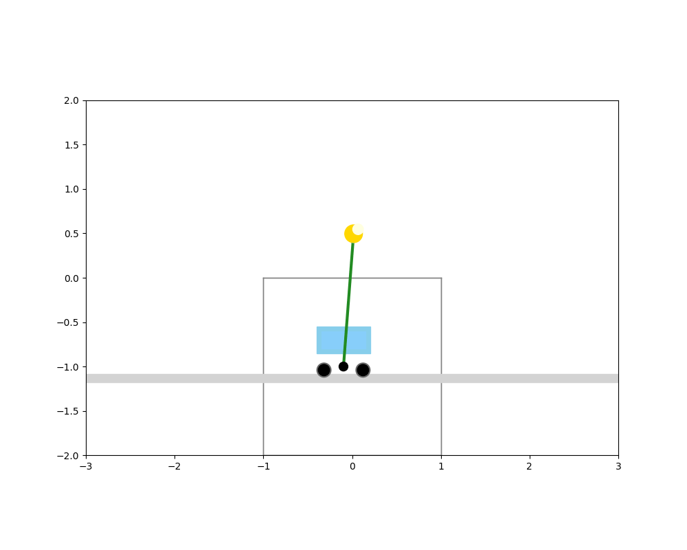

# Projeto CartPole em 3D (Simulado) com Visualização Aprimorada

[](https://opensource.org/licenses/MIT)

Este projeto visa criar uma visualização rica e envolvente do clássico problema do CartPole, um ambiente fundamental no aprendizado por reforço. Em vez da tradicional representação 2D, exploramos uma abordagem que simula um cenário 3D rotativo para proporcionar uma compreensão mais intuitiva da dinâmica do sistema.

## 🚀 Demonstração

Veja a animação do CartPole em 3D:

<p align="center">
  
</p>

## 🎯 Objetivo

O principal objetivo deste projeto é aprimorar a visualização do ambiente CartPole, tornando a dinâmica do pêndulo e do carrinho mais compreensível através de uma simulação 3D animada. Isso permite uma melhor intuição sobre o desafio de balancear o pêndulo e pode servir como uma base visual para futuros estudos de controle ou aprendizado por reforço.

## ✨ Funcionalidades

* **Simulação 3D do CartPole**: Representação visual do carrinho com rodas, haste e massa em um ambiente simulado em 3D.
* **Terreno Rotativo**: Um plano de chão rotativo em 3D para adicionar profundidade e contexto à cena.
* **Animação Dinâmica**: Animação suave do movimento do carrinho e do pêndulo, refletindo a física do sistema.
* **Visualização Aprimorada**: Uso de patches do Matplotlib para criar formas detalhadas, como as rodas e a massa do pêndulo.

## 💻 Tecnologias Utilizadas

As seguintes tecnologias e bibliotecas Python foram utilizadas neste projeto:

* **Python**: A linguagem de programação principal para o desenvolvimento do projeto.
* **OpenAI Gym (`gym`)**: Utilizado para acessar e interagir com o ambiente de simulação do CartPole (`CartPole-v1`).
* **NumPy**: Fundamental para realizar operações numéricas eficientes, especialmente no cálculo das posições dos elementos e na simulação da rotação do terreno.
* **Matplotlib**: A principal biblioteca de visualização em Python, utilizada para criar a figura, os eixos e os diferentes elementos gráficos, bem como para gerar a animação quadro a quadro.
    * `matplotlib.animation`: Essencial para gerar a animação dinâmica.
    * `matplotlib.patches`: Módulo utilizado para criar formas geométricas como `Rectangle` e `Circle`.
* **Pillow**: Necessário para que o Matplotlib possa salvar a animação no formato GIF.
* **IPython Display**: Usado para exibir a animação diretamente no Jupyter Notebook.

## ⚙️ Como Executar

Para rodar este projeto localmente, siga os passos abaixo:

1.  **Clone o repositório:**
    ```bash
    git clone [https://github.com/SeuNomeDeUsuario/Projeto_CartPole_em_3D.git](https://github.com/SeuNomeDeUsuario/Projeto_CartPole_em_3D.git)
    cd Projeto_CartPole_em_3D
    ```
    *(Lembre-se de substituir `SeuNomeDeUsuario` pelo seu nome de usuário do GitHub.)*

2.  **Crie e ative um ambiente virtual (recomendado):**
    ```bash
    python -m venv venv
    # No Windows:
    .\venv\Scripts\activate
    # No macOS/Linux:
    source venv/bin/activate
    ```

3.  **Instale as dependências:**
    Certifique-se de que o arquivo `requirements.txt` foi gerado (veja a seção abaixo). Com o ambiente virtual ativado, instale as bibliotecas:
    ```bash
    pip install -r requirements.txt
    ```

4.  **Execute o Notebook Jupyter:**
    ```bash
    jupyter notebook Projeto_CartPole_3D.ipynb
    ```
    Abra o notebook `Projeto_CartPole_3D.ipynb` e execute as células para ver a simulação e a animação.

## 🤝 Contribuições

Contribuições são muito bem-vindas! Se você tiver ideias para melhorias, novas funcionalidades ou encontrar algum problema, sinta-se à vontade para:

* Abrir uma **Issue** para relatar bugs ou sugerir melhorias.
* Enviar um **Pull Request** com suas implementações.

## 📄 Licença

Este projeto está licenciado sob a Licença MIT. Para mais detalhes, consulte o arquivo [LICENSE.md](LICENSE.md) na raiz do repositório.

## 📧 Contato

Se você tiver alguma dúvida ou sugestão, pode entrar em contato com Flávio Henrique Barbosa:

* **Nome:** Flávio Henrique Barbosa
* **LinkedIn:** [Flávio Henrique Barbosa | LinkedIn](https://www.linkedin.com/in/fl%C3%A1vio-henrique-barbosa-38465938)
* **Email:** flaviohenriquehb777@outlook.com

---
